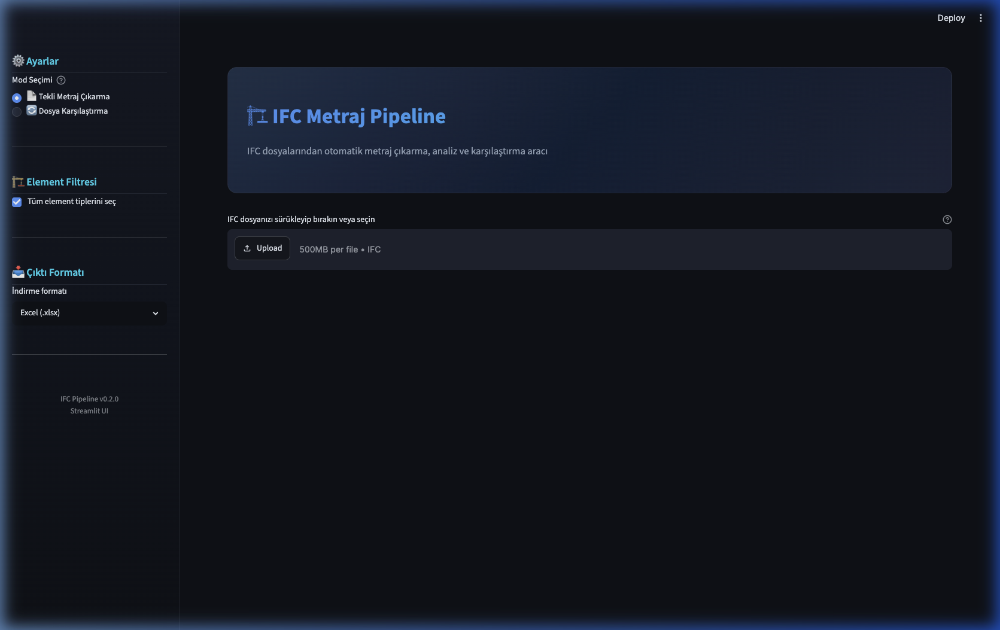

# IFC Pipeline — IFC Dosyalarından Otomatik Metraj Çıkarma

IFC (Industry Foundation Classes) dosyalarından element bazlı metraj verisi çıkaran, normalize eden, kalite kontrolü yapan ve Excel/JSON formatında raporlayan bir Python pipeline'ıdır.



## Özellikler

- **🌐 Web Arayüzü (Streamlit)**: Tarayıcı tabanlı modern dark-theme arayüz
- **🐳 Docker Desteği**: Tek komutla (`docker compose up`) her yerde çalışır
- **🖥️ CLI Modu**: Terminal üzerinden tam kontrol
- **Çoklu Yazılım Desteği**: Revit, Tekla, Archicad, Allplan, Vectorworks çıktılarını otomatik tanır
- **Fallback Zincir Sistemi**: Farklı yazılımların kullandığı Pset/Qto isimlerini YAML config ile eşler
- **Otomatik Birim Dönüşümü**: mm, cm, ft, inch → metre/m²/m³ otomatik çevrim
- **Veri Kalitesi Raporu**: Eksik metraj, duplicate GlobalId, katsız element tespiti
- **Karşılaştırma Modu**: Birden fazla IFC dosyası arasındaki metraj sapmalarını ölçer
- **Maliyet Hesabı**: Birim fiyat tablosu ile otomatik maliyet hesaplaması
- **Detaylı Excel Raporu**: Çok sekmeli, formatlanmış Excel çıktısı

---

## Hızlı Başlangıç

### Ön Gereksinimler

- **Python 3.10+**
- **pip** (Python paket yöneticisi)
- **Docker** (opsiyonel — Docker ile çalıştırma için)

### Kurulum

```bash
# Repoyu klonla
git clone <repo-url>
cd ifc_projesi

# Bağımlılıkları yükle
pip install -r requirements.txt
```

> **Not:** `ifcopenshell` kurulumu platforma göre farklılık gösterebilir.
> Detaylı bilgi: https://ifcopenshell.org/

---

## Kullanım

### 🌐 Web Arayüzü (Streamlit) — ÖNERİLEN

En kolay kullanım yöntemi. Tarayıcı tabanlı, drag & drop destekli arayüz:

```bash
streamlit run app.py
```

Tarayıcınızda otomatik açılır: **http://localhost:8501**

#### Web Arayüzü Özellikleri

| Özellik | Açıklama |
|---------|----------|
| 📄 **Tekli Metraj Çıkarma** | IFC dosyasını sürükle-bırak ile yükle, otomatik analiz |
| 🔄 **Dosya Karşılaştırma** | 2+ IFC dosyasını karşılaştır, sapmaları analiz et |
| 🏗️ **Element Filtresi** | Sidebar'dan istediğin element tiplerini seç/kaldır |
| 📊 **İnteraktif Tablolar** | Sıralama, arama, filtreleme destekli veri görüntüleme |
| 📥 **Excel/JSON İndirme** | Tek tıkla formatlanmış rapor indir |
| 🔍 **Veri Kalitesi** | Eksik metraj, coverage oranları, uyarılar |
| 📈 **Özet İstatistikler** | Element sayıları, toplam alan/hacim metrikleri |

#### Kullanım Adımları

1. `streamlit run app.py` komutuyla uygulamayı başlatın
2. Tarayıcıda **http://localhost:8501** adresine gidin
3. Sol panelden **mod seçin** (Tekli Metraj / Karşılaştırma)
4. IFC dosyanızı **sürükleyip bırakın** veya Upload butonuna tıklayın
5. Pipeline otomatik çalışır, sonuçlar ekranda görünür
6. **İndir butonlarıyla** Excel veya JSON raporu alın

---

### 🐳 Docker ile Çalıştırma

Docker kuruluysa, hiçbir Python bağımlılığı yüklemenize gerek yok:

```bash
# Tek komutla build + çalıştır
docker compose up --build

# Arka planda çalıştır
docker compose up --build -d

# Durdur
docker compose down
```

Tarayıcınızda: **http://localhost:8501**

#### Docker Detayları

| Ayar | Değer |
|------|-------|
| **Base image** | Python 3.11-slim |
| **Port** | 8501 |
| **Bellek limiti** | 4GB (büyük IFC dosyaları için) |
| **Upload limiti** | 500 MB |
| **Auto-restart** | Evet (`unless-stopped`) |
| **Health check** | 30s aralıkla |

#### Docker Ortam Değişkenleri

`docker-compose.yml` dosyasından ayarlanabilir:

```yaml
environment:
  - STREAMLIT_SERVER_PORT=8501          # Sunucu portu
  - STREAMLIT_SERVER_ADDRESS=0.0.0.0    # Tüm ağlardan erişim
  - STREAMLIT_THEME_BASE=dark           # Tema (dark/light)
```

---

### 🖥️ Terminal (CLI) Modu

Otomasyon ve script entegrasyonu için:

#### İnteraktif Mod (Pencereli)
```bash
python3 main.py
```
Dosya seçme penceresi açılır, IFC dosyasını seçin. Çıktı aynı dizine kaydedilir.

#### Terminal Komutları

```bash
# Dosya bilgisi inceleme
python3 main.py inspect proje.ifc

# Metraj çıkarma
python3 main.py extract proje.ifc -o metraj.xlsx

# Sadece belirli element tipleri
python3 main.py extract proje.ifc --types wall beam column

# JSON formatında çıktı
python3 main.py extract proje.ifc -o metraj.json

# Birden fazla dosya karşılaştırma
python3 main.py compare revit.ifc tekla.ifc -o karsilastirma.xlsx

# Detaylı log
python3 main.py --verbose extract proje.ifc
```

---

## Proje Yapısı

```
ifc_projesi/
├── app.py                  # 🌐 Streamlit web arayüzü
├── main.py                 # 🖥️ CLI & interaktif giriş noktası
├── config/
│   └── mapping.yaml        # Element tipi ↔ IFC class eşleme yapılandırması
├── ifc_pipeline/
│   ├── __init__.py          # Paket export'ları
│   ├── loader.py            # IFC dosya açma ve yazılım tespiti
│   ├── units.py             # Birim sistemi tespiti ve SI dönüşümü
│   ├── properties.py        # Property Set ve Quantity Set okuma
│   ├── extractor.py         # Element veri çıkarma motoru
│   ├── normalizer.py        # DataFrame oluşturma ve veri kalitesi
│   ├── exporter.py          # Excel ve JSON çıktı yazıcı
│   └── comparator.py        # Çoklu dosya karşılaştırma
├── tests/                   # Unit testler
├── Dockerfile               # 🐳 Docker konteyner tanımı
├── docker-compose.yml       # 🐳 Docker Compose konfigürasyonu
├── .dockerignore            # Docker build hariç tutmaları
├── .streamlit/
│   └── config.toml          # Streamlit tema ve sunucu ayarları
├── requirements.txt         # Python bağımlılıkları
└── README.md
```

---

## Desteklenen Element Tipleri

| Tip | IFC Sınıfları |
|-----|---------------|
| Duvar | IfcWall, IfcWallStandardCase, IfcWallElementedCase |
| Kiriş | IfcBeam, IfcBeamStandardCase |
| Kolon | IfcColumn, IfcColumnStandardCase |
| Döşeme | IfcSlab |
| Kapı | IfcDoor |
| Pencere | IfcWindow |
| Çatı | IfcRoof |
| Merdiven | IfcStair, IfcStairFlight |
| Temel | IfcFooting |
| Kazık | IfcPile |
| Eleman (Çelik) | IfcMember, IfcMemberStandardCase |
| Giydirme Cephe | IfcCurtainWall |
| Korkuluk | IfcRailing |
| Rampa | IfcRamp, IfcRampFlight |
| Kaplama | IfcCovering |
| Plaka (Çelik) | IfcPlate |

---

## Yapılandırma

### Streamlit Ayarları

`.streamlit/config.toml` dosyasından tema ve sunucu ayarları yapılır:

```toml
[theme]
base = "dark"                    # dark veya light
primaryColor = "#4f8ef7"         # Ana renk

[server]
maxUploadSize = 500              # Maksimum yükleme boyutu (MB)
```

### Element Eşleme

`config/mapping.yaml` dosyasından yeni element tipleri, Pset/Qto isimleri eklenebilir.
Farklı BIM yazılımlarının kullandığı property isimleri fallback zincirleriyle desteklenir.

---

## Sorun Giderme

| Sorun | Çözüm |
|-------|-------|
| `ifcopenshell` kurulumu başarısız | Docker ile çalıştırın: `docker compose up --build` |
| Metraj değerleri boş geliyor | Revit'te export sırasında "Export base quantities" seçeneğini açın |
| Büyük dosyalarda bellek hatası | Docker'da memory limitini artırın (`docker-compose.yml`) |
| Port 8501 meşgul | `streamlit run app.py --server.port 8502` ile farklı port kullanın |
| Tarayıcı otomatik açılmıyor | Manuel olarak `http://localhost:8501` adresine gidin |

---

## Lisans

Bu proje akademik/tez çalışması kapsamında geliştirilmiştir.
